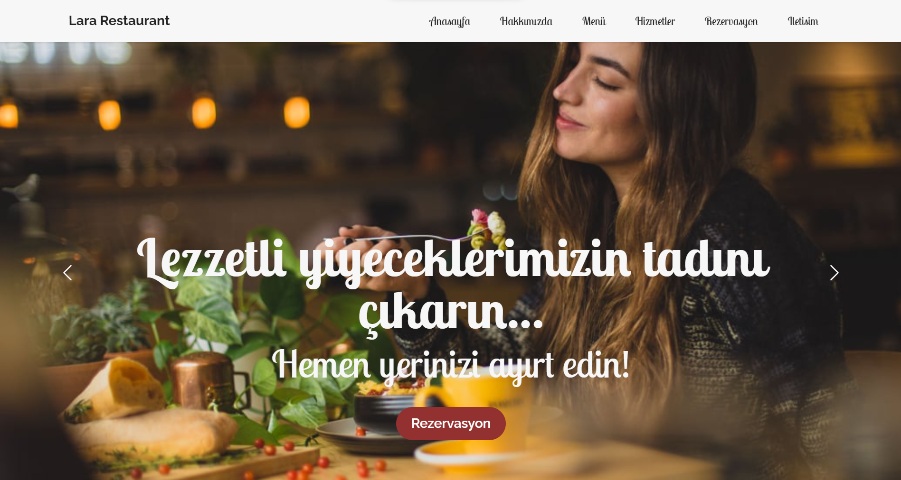
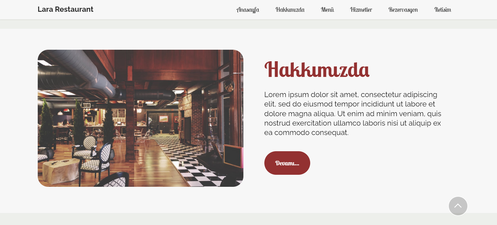
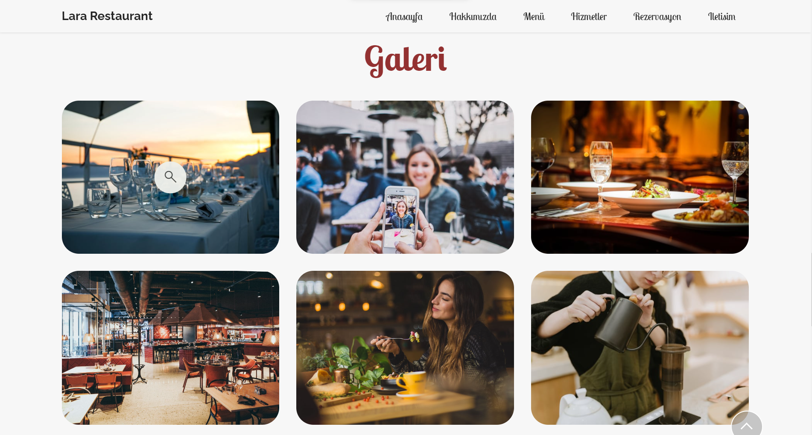
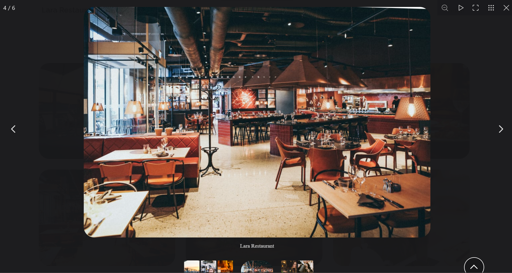
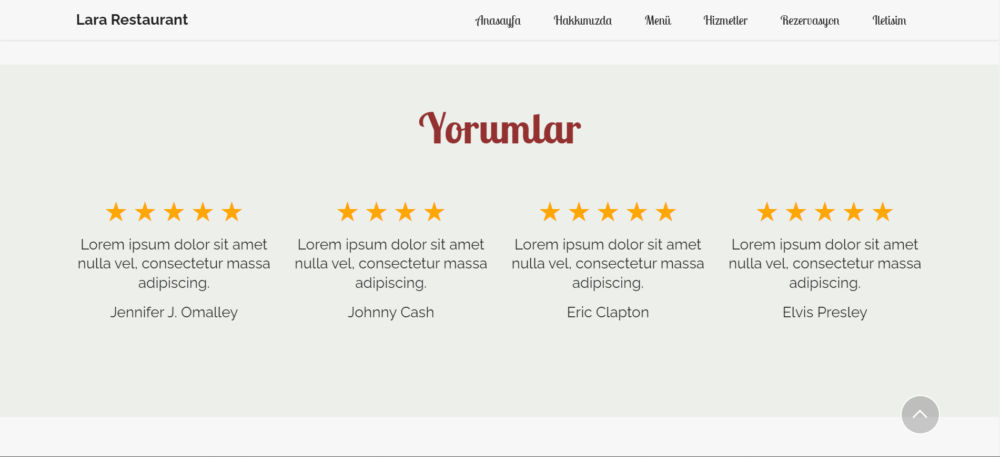
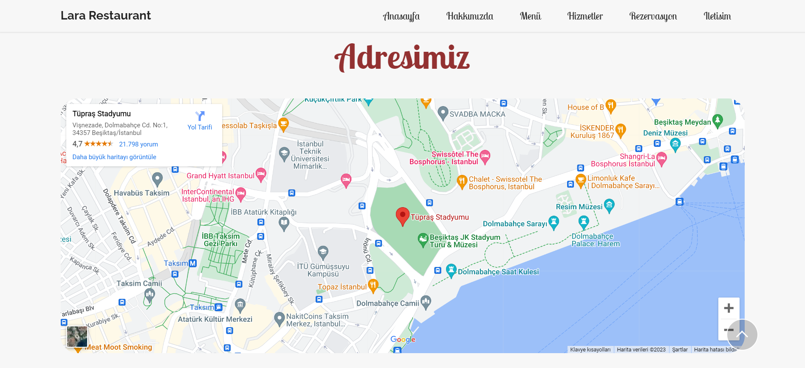
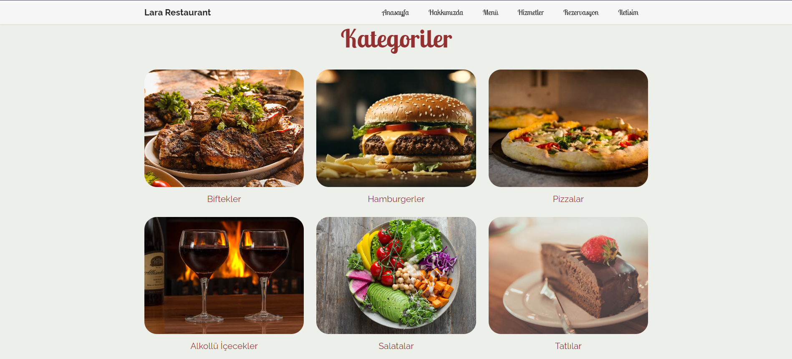
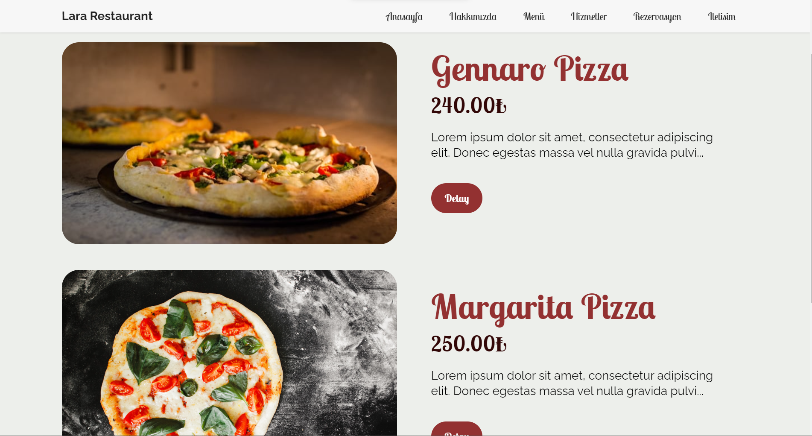
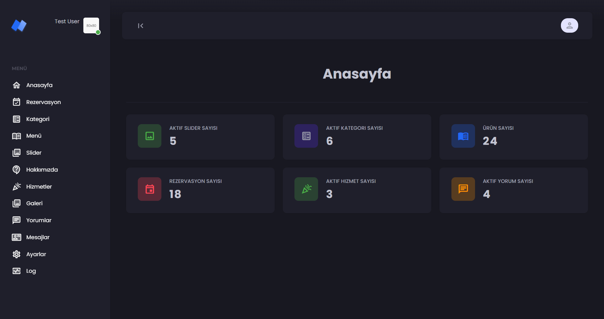
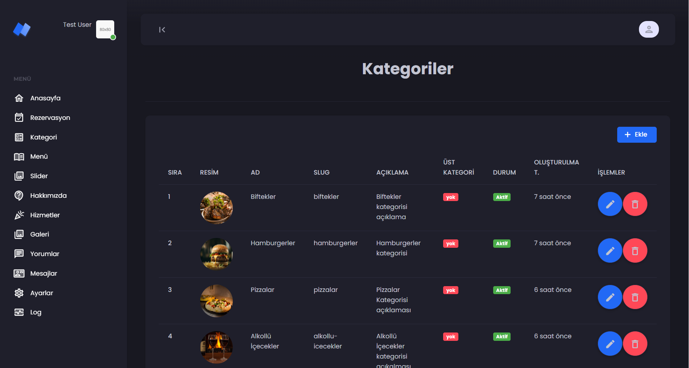

# Restaurant Reservation System with Laravel
This project is a restaurant reservation system developed using the Laravel framework. It incorporates several key features and best practices.

## Features

### Laravel Queue Structure
I implemented a Laravel queue structure to efficiently handle the reservation system's background tasks.

### Email Notification System
Customers receive email notifications upon making a reservation. Additionally, the system notifies customers in case of reservation cancellations by the admin.

### Observer for Sorting
I utilized Laravel observers to streamline the sorting of categories, menus, and pictures, enhancing the overall project organization.

### SEO-Friendly URLs
Category and menu URLs have been designed to be completely SEO-friendly, contributing to better search engine visibility.

### Front-End Optimization
I implemented a Laravel cache structure on the front end to enhance performance and provide a smoother user experience.

## Getting Started
To get started with the project, follow these steps:
1. Clone the repository.
2. Configure mail settings.
3. Configure the Laravel queue system.
4. Set up email notification settings.

## Packages and libraries
1-For pictures
### https://fancyapps.com/
2-For Category,Menu and Image order
### https://www.jsdelivr.com/package/npm/sortablejs
3-For Seo friendly url 
### https://github.com/spatie/laravel-sluggable
4-For log-viewer
### https://github.com/opcodesio/log-viewer

## Screenshots
### Site

### Panel

